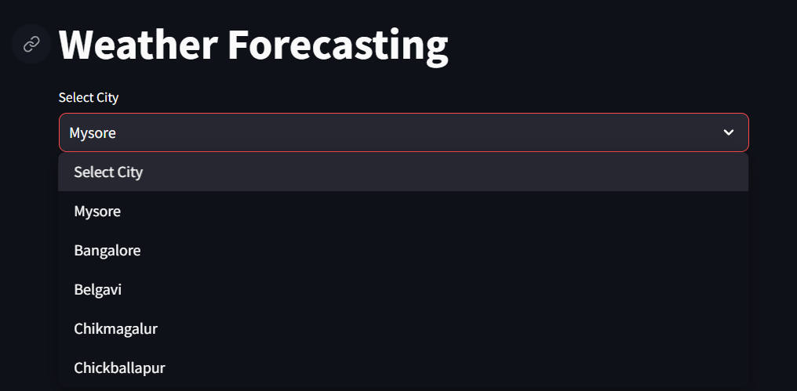
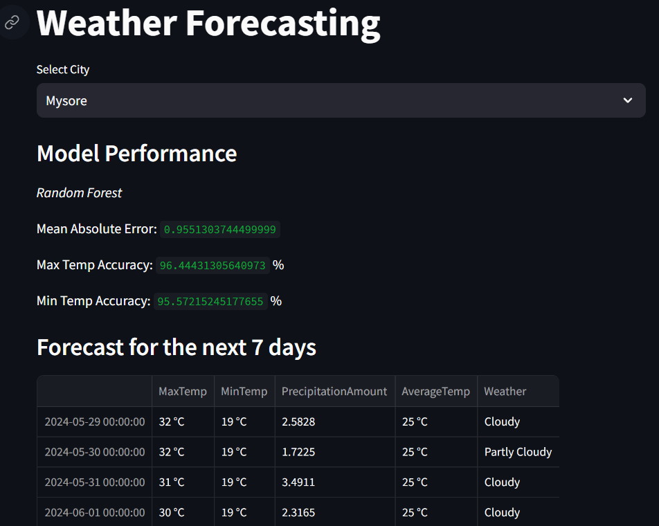

# weather-prediction-ML-
This repository contains a weather prediction model developed using machine learning techniques, specifically leveraging the power of the Random Forest algorithm

Weather Prediction Using Machine Learning
This repository contains a weather prediction model developed using machine learning techniques, specifically leveraging the power of the Random Forest algorithm. The goal of this project is to accurately forecast weather conditions based on historical data.

Project Overview
Weather prediction is a complex task that involves analyzing vast amounts of historical weather data to identify patterns and trends. By utilizing the Random Forest algorithm, this project aims to provide reliable weather forecasts, which can be beneficial for various applications, such as agriculture, disaster management, and daily planning.

Features
Data Preprocessing: Clean and preprocess historical weather data.

Feature Engineering: Select and engineer relevant features for improved model performance.

Model Training: Train a Random Forest model on the preprocessed data.

Prediction: Generate weather forecasts using the trained model.

Evaluation: Assess model performance using standard metrics.

Visualization: Visualize data and prediction results for better interpretation.


Dataset
The dataset used for this project consists of historical weather data sourced from the NASA POWER (Prediction of Worldwide Energy Resource) Project. This dataset includes parameters such as temperature, humidity, wind speed, and precipitation, providing comprehensive weather information for accurate modeling.

Source: NASA POWER
Model
Random Forest Algorithm
Random Forest is an ensemble learning method that constructs multiple decision trees during training and outputs the mode of the classes for classification tasks or the mean prediction for regression tasks. It reduces overfitting and improves accuracy through the aggregation of multiple trees.

Advantages:
Handles large datasets with higher dimensionality.

Maintains accuracy even when a large proportion of data is missing.

Reduces overfitting compared to single decision trees.

Technologies Used

Python: The primary programming language used for data processing, model training, and evaluation.

Scikit-learn: A powerful machine learning library in Python used to implement the Random Forest algorithm.

Pandas: For data manipulation and preprocessing.

NumPy: For numerical computations.

Matplotlib & Seaborn: For data visualization to better understand the dataset and model performance.


Installation

To run this project locally, follow these steps:

1. **Clone the repository**:
    ```sh
    git clone https://github.com/yourusername/weather-prediction.git
    ```

2. **Navigate to the project directory**:
    ```sh
    cd weather-prediction
    ```

3. **Install the required dependencies**:
    ```sh
    pip install -r requirements.txt
    ```


Results
City Weather Forecast



User Interface



Contributing
Contributions are welcome! If you have any suggestions or improvements, please submit a pull request or open an issue.

Acknowledgements
Scikit-learn Documentation
Pandas Documentation
NumPy Documentation


